# CCIT4080A-CL03-19-20 Group 2 Project on Knowledge Products Developments

## Smart mirror logbook

Members:

- Lo Chi Fung (20067104)
- Wong Kwai Yuen (20122586)
- Yung Yu Hin (20121518)

---

### Todo-list

<details>
    <summary> Project material (hardware required)</summary>

- [x] Buying all project material
- [x] Raspberry Pi​ 4B
- [x] Monitor​
- [x] Raspberry Pi camera​
- [x] Microphone​
- [x] Speaker​
- [x] SD card​
- [x] Two way mirror film

</details>

<details>

  <summary> Rasberry Pi 4b setting and assembling (checked and done)</summary>

- [x] Set up raspberry pi and operating system
  - [x] Assembling Raspberry Pi
  - [x] System Testing
  - [x] Camera Testing
  - [x] Package install

</details>
<details>

<summary> Modules development </summary>

- [ ] Build All module
  - [x] Hello world module for testing
  - [x] Google assistant API
  - [x] weather display
  - [x] Schedule and Calendar​
  - [x] Daily News
  - [X] Email
  - [x] Music player​
  - [ ] Gestures detection
  - [ ] Connect with mobile application (maybe)

</details>
<details>

<summary> Function Applicate </summary>

- [ ] Applied All Function
  - [X] AI assistant
  - [x] weather display
  - [X] Schedule and Calendar​
  - [X] Daily News
  - [X] Email
  - [x] Music player​
  - [ ] Gestures detection
  - [ ] Connect with mobile application (maybe)

</details>

<details>

<summary> other works </summary>

- [X] Debug module
- [X] Assembling the smart mirror with outer casing
- [X] Create project video​

</details>

---

### Schedule

---

<details>

<summary> Assignment Submitted </summary>

- [x] Project presentation preparetion
- [x] Project present
- [x] Submit logbook at sem1
- [x] Writing Interim Report (min: 1000 words)
- [x] submission of Report
- [X] Writting Final Report (min: 2000 words)
- [X] Writting the Individual self-reflection report (min: 500 words)
- [X] submission of Individual self-reflection report
- [X] Finalizing the final report and presentation

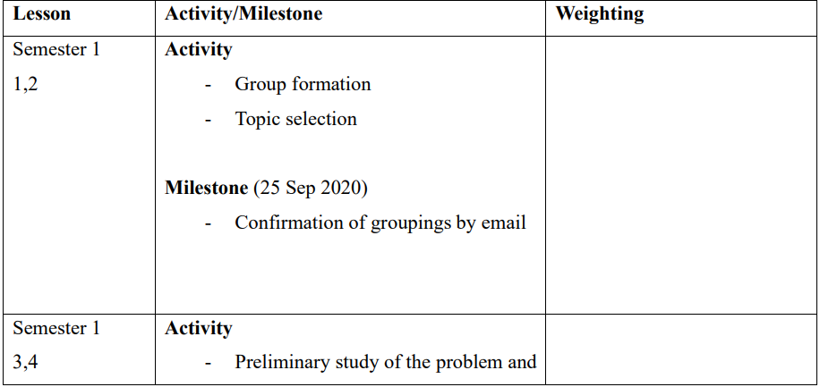
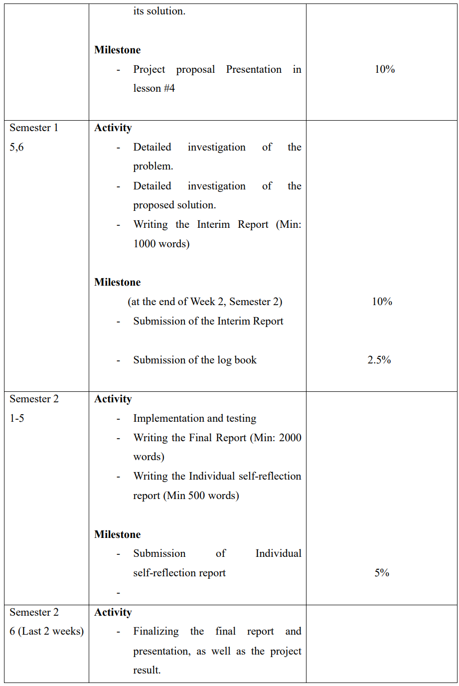
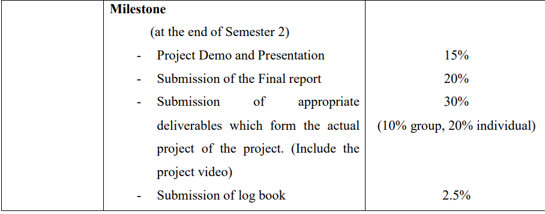

</details>

#### 12/11/2020

---

<details>
    <summary> Rasberry Pi assemble and installation start up</summary>
    
---
##### Assembling Raspberry Pi 
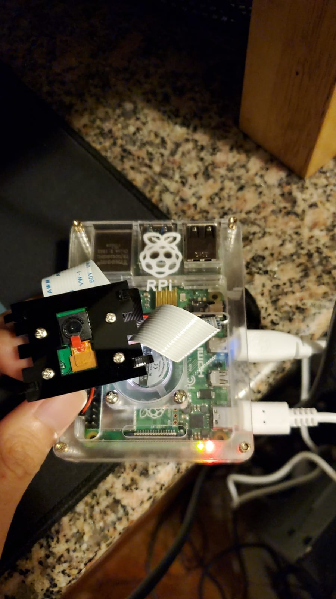

---

##### Set up operating system

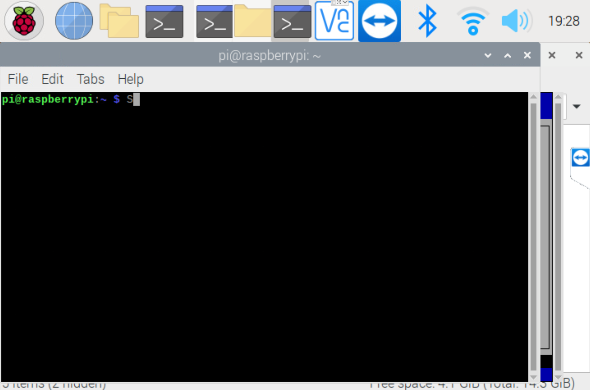

###### Code sample:

```bash
sudo apt-get update
sudo apt update
sudo apt full upgrade
```

---

##### Camera Testing

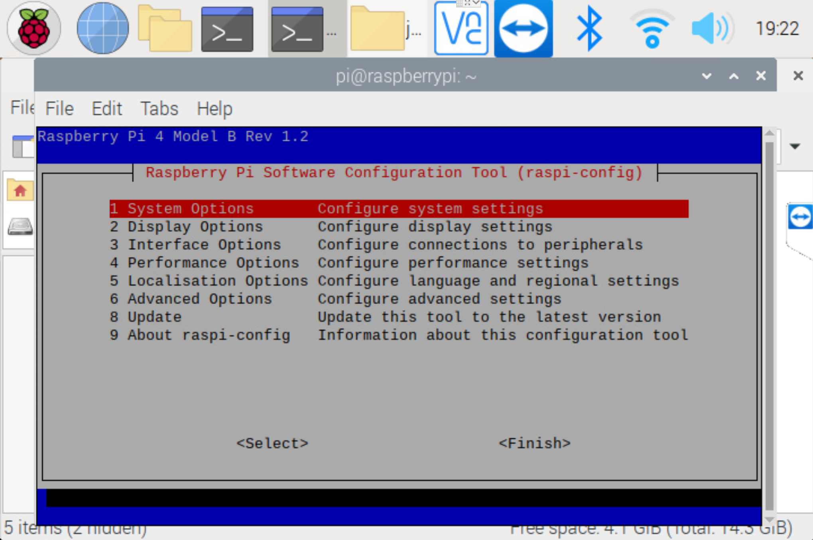

- Interfacing Options > Enable camera > Test camera

###### Code sample:

```bash
sudo raspi-config
raspistill -v -o test.jpg
```


---

##### Package installed:

- [Teamviewer](https://www.teamviewer.com/en/download/raspberry-pi/)
- Git
- [MagicMirror][1]

###### Code Sample:

```bash
sudo apt install git
sudo apt install -y nodejs
git clone https://github.com/hongkongno1/jimslochifung
cd Project\MagicMirror
npm install # install nodejs
npm run start # Host server for the smart mirror
```

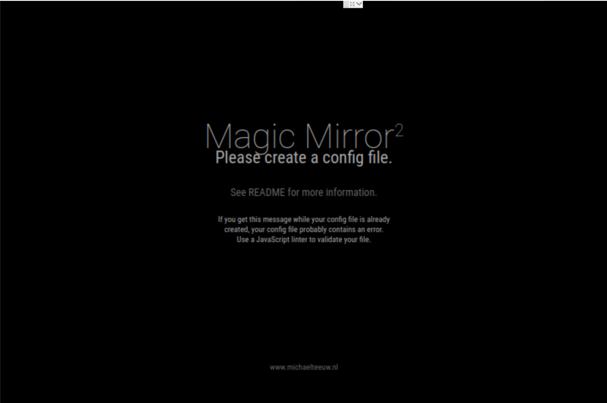

</details>

---

#### 19/11/2020

---

<details>
    <summary> Collaborating setting </summary>

##### Collaborating with teamviewer for control the Raspberry Pi

---

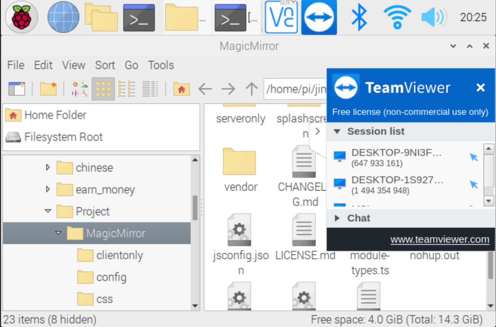

##### Testing system for out local computer

---

1. Install [NodeJS](https://nodejs.org/en/) from Windows
2. Add path on Windows
3. Type following command on Git Bash/GitHub Desktop

```cmd
git clone https://github.com/hongkongno1/jimslochifung
cd Project/MagicMirror
npm install
npm run start
```

###### Error occurred

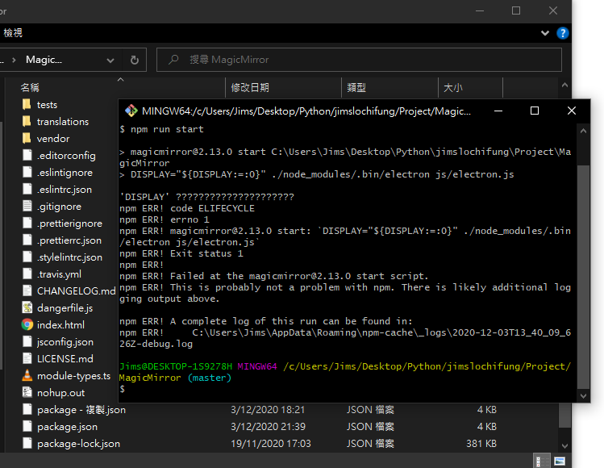

How to solve:

- edit `package.json` line 7
  delete `DISPLAY=\"${DISPLAY:=:0}\"...`

- Install Nodejs module in another sub folder
  Code sample:

```
cd Project\MagicMirror
cd vendor
npm install
cd ..
cd fonts
npm install
cd ..
```

- Finally host server with 8080 port (`npm run server `)
- 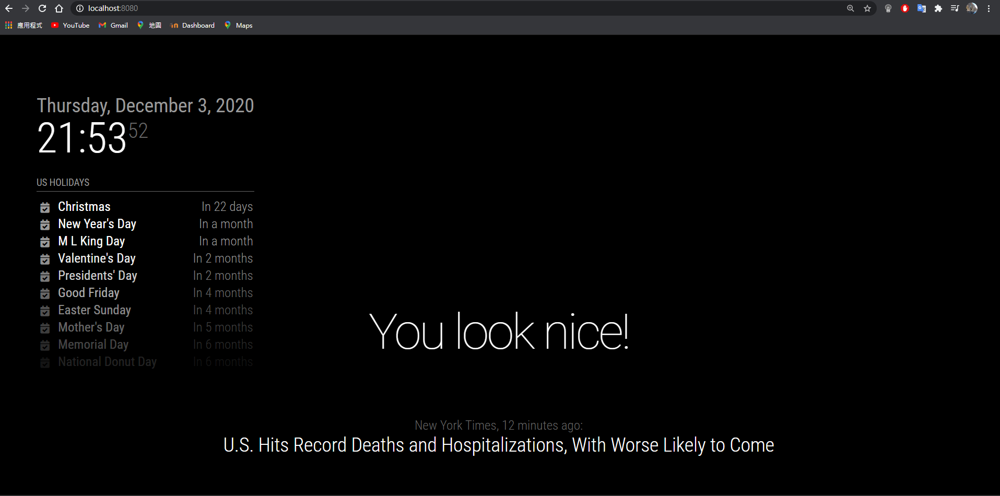

</details>

---

#### 26/11/2020

---

<!-- <details> -->
<details>
    <summary> Building hello world module </summary>
  
##### Build hello world module

- Step1: add a new file to `MagicMirror/module` called "helloworld"

- Step2: add a `.js` file which is the core file call `helloworld.js`

- Step3: add the following code

  ```js
  //helloworld.js:

  Module.register("helloworld", {
    // Default module config.
    defaults: {},

    // Override dom generator.
    getDom: function () {
      var wrapper = document.createElement("div");
      wrapper.innerHTML = "helloworld";
      return wrapper;
    },
  });
  ```

- Step4: add module to MagicMirror/config/config.js

  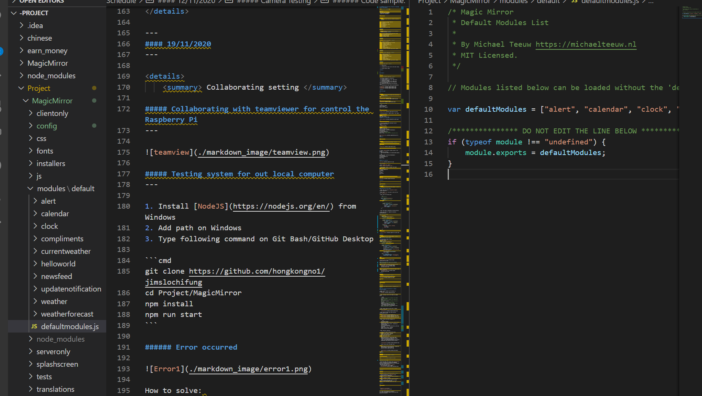

- Step5: add module to MagicMirror/modules/defaultmodules.js

##### After modified:

```js
Module.register("helloworld", {
  // Default module config.
  defaults: {},
  // Override dom generator.
  getDom: function () {
    var wrapper = document.createElement("div");
    wrapper.innerHTML = this.teammate();
    return wrapper;
  },
  teammate() {
    let text = "jimslo, kylewong, springyung";
    return text;
  },
});
```

##### result:

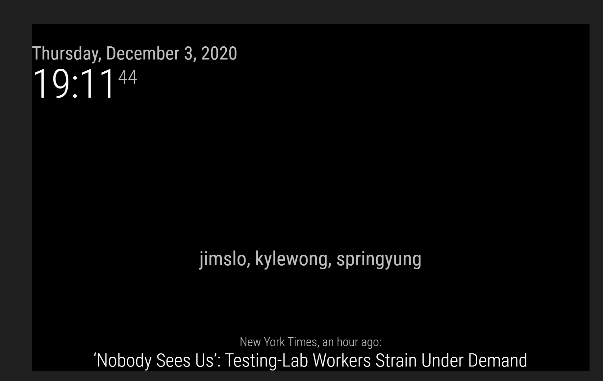

</details>

<details>
    <summary> Build new testing module </summary>
    
##### Build new testing module

- Following above steps to build
- New code sample:

  ```js
  Module.register("testmodule", {
    // Default module config.
    defaults: {},
    // Override dom generator.
    getDom: function () {
      var wrapper = document.createElement("div");
      var ourgroupname = document.createElement("div");
      ourgroupname.innerHTML = "this is the new build test module";

      wrapperappendChild(ourgroupname);
      return wrapper;
    },
    start: function () {
      this.mySpecialProperty = "So much wow!";
      console.log(this.name + " is started!");
    },
  });
  ```

##### Result:

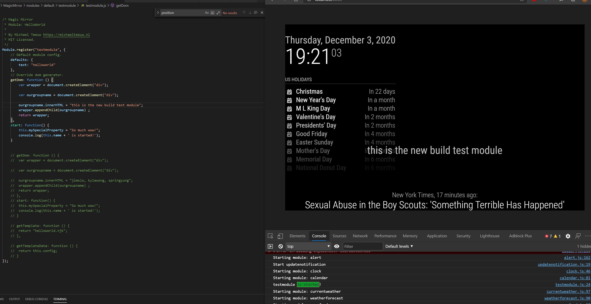

##### testing different module with customize position result:

- try to apply in different position with both "hellowworld" and "new testing" module
  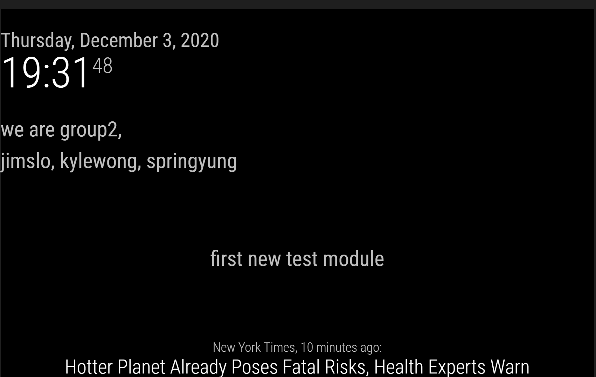

- try to change different background image of the mirror app by css
  

</details>

<details>
  <summary> Error occurred </summary>

##### unable to commit and push to github

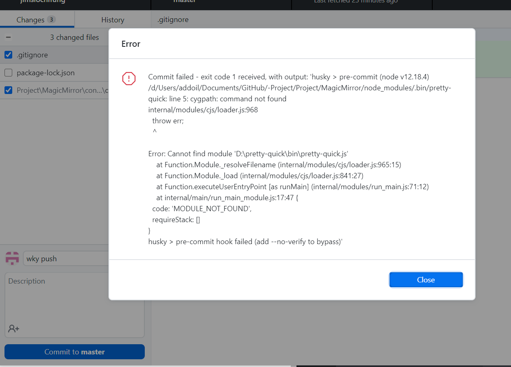

</details>

---

#### 3/12/2020

---

<details>

<summary> Setup Google Assistant in Raspberry Pi </summary>

##### After Reading documentation of [Google Assistant SDK][2]

- Step1: Connect Speaker and Microphone in Raspberry Pi
  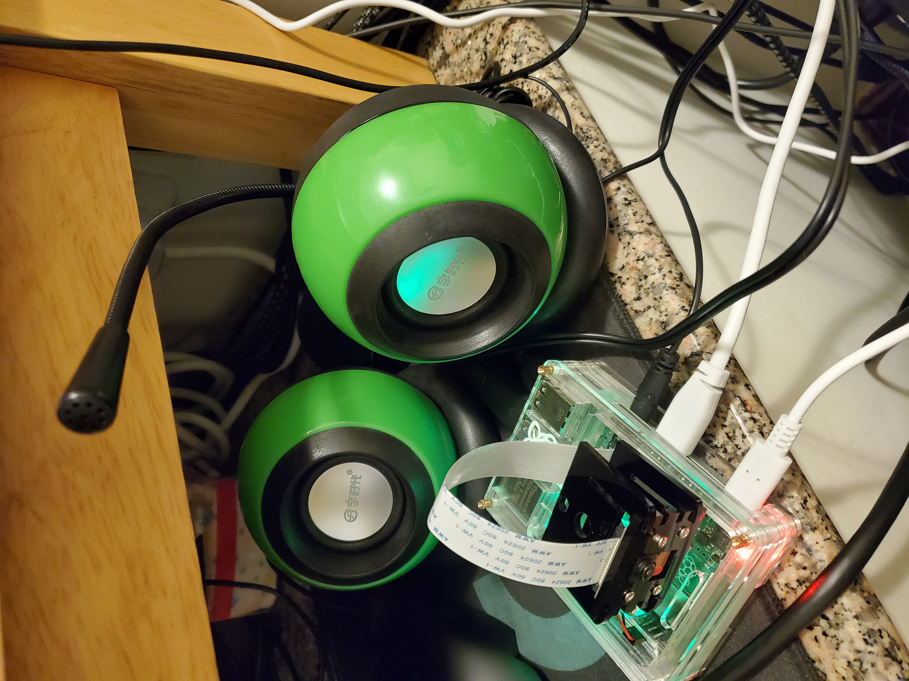

- Step2: Configure and Test the Audio by command below

  ```bash
  arecord -l # Find the microphone card number and device number
  aplay -l # Find the speaker card number and device number
  sudo nano ~/.asoundrc # Configue the audio in the file
  alsamixer # adjust playback volume
  speaker-test -t wav # Testing speaker sound
  arecord --format=S16_LE --duration=5  --rate=16000 --file-type=raw out.raw
  aplay --format=S16_LE --rate=16000 out.raw # Playing audio after recorded
  ```

- Step3: Enable Google Assistant API in Google developer console

  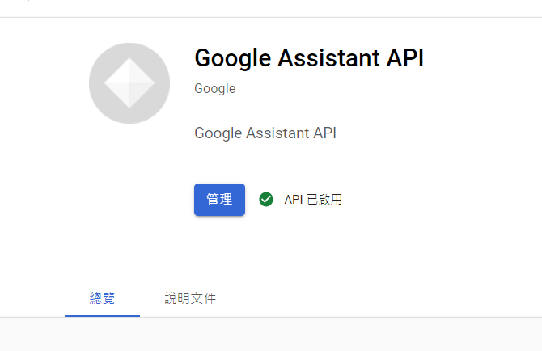

- Step4: Register Model and create external authorization for API

  - allow activity for the Raspberry Pi
    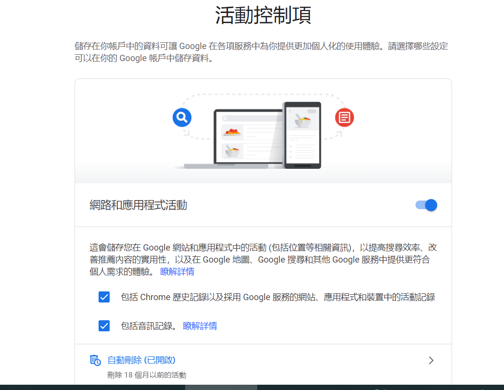
  - Setup device on Actions Consoles
    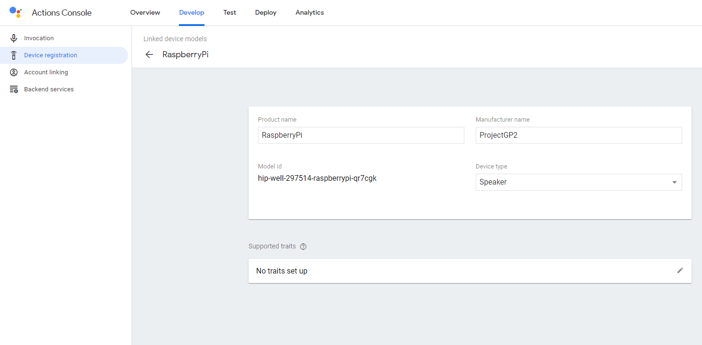

- Step5: Install the SDK on Raspbarry Pi

  ```bash
  sudo apt-get update
  sudo apt-get install python3-dev python3-venv
  python3 -m venv env
  env/bin/python -m pip install --upgrade pip setuptools wheel
  source env/bin/activate
  sudo apt-get install portaudio19-dev libffi-dev libssl-dev
  python -m pip install --upgrade google-assistant-sdk[samples]
  ```

- Step6: Generate creditials

  - install the google authentication tool
    ```bash
    python -m pip install --upgrade google-auth-oauthlib[tool]
    ```
  - Get authorization code

    ```
    google-oauthlib-tool --scope https://www.googleapis.com/auth/assistant-sdk-prototype --save --client-secrets /home/pi/client_secret_388227243623-33csmkt71iq6aopknocupb769hpkrhg7.apps.googleusercontent.com.json
    ```

    

  - Step7: Run and test the sample code

    ```
    googlesamples-assistant-pushtotalk --project-id hip-well-297514 --device-model-id hip-well-297514-raspberrypi-qr7cgk
    ```

    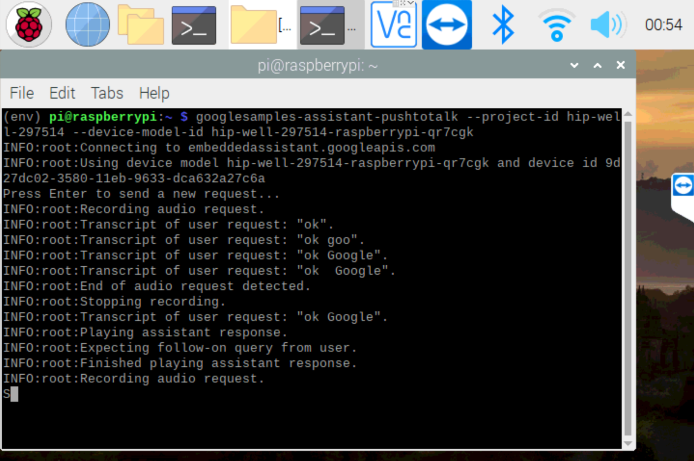

</details>

<details>
  <summary> Error and solution </summary>

##### Error occurred

- 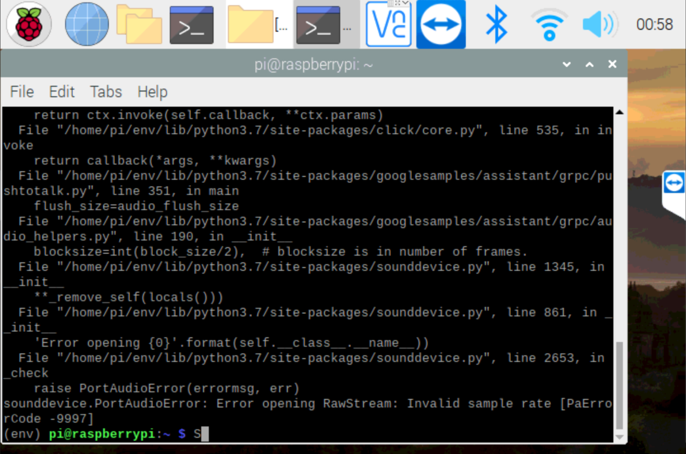

##### How to work out:

- Search and apply the solution from [stackoverflow](https://stackoverflow.com/questions/56908430/how-to-fix-sounddevice-portaudioerror-error-opening-rawstream-invalid-sample-r)
- Edit the file from `/home/pi/.asoundrc`
  - set the sampling rate to 16000
    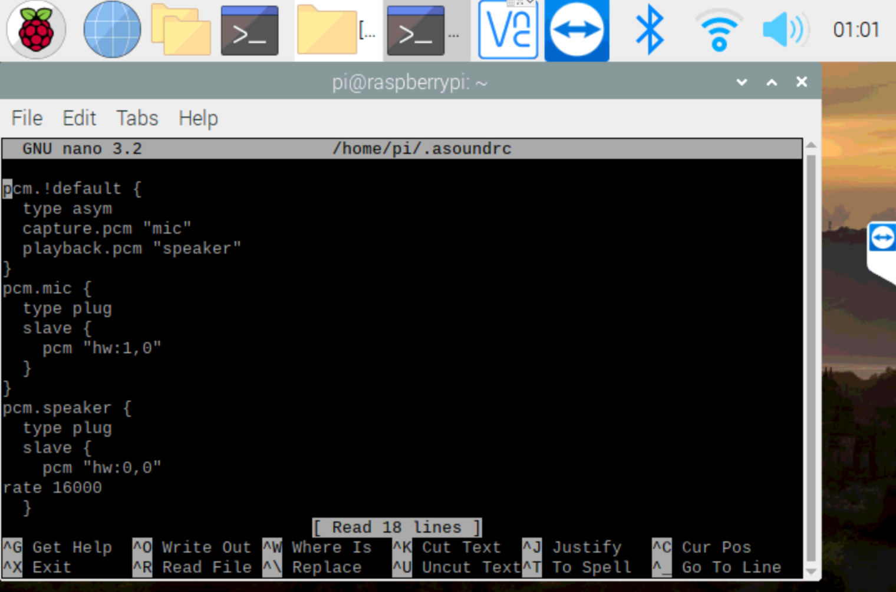

</details>

<details>

<summary> Continue of developing module</summary>

- reading documentation of [MagicMirror][1]
- learning the CSS of MagicMirror
  - 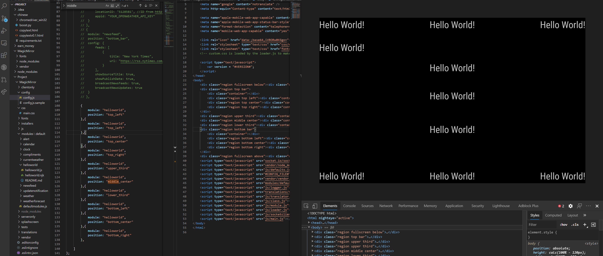
- tried to change the layout
  - 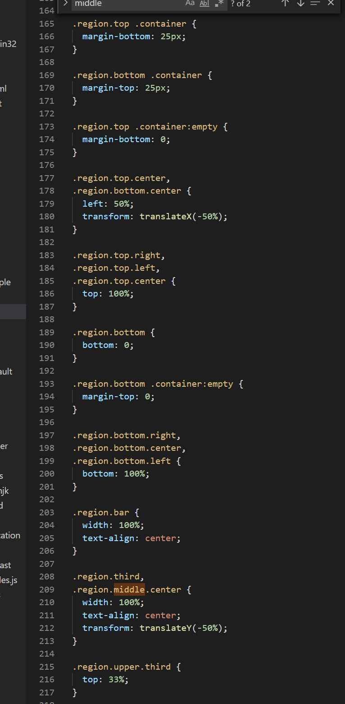
- tried to use the open source default weather module with applying weather API
  - 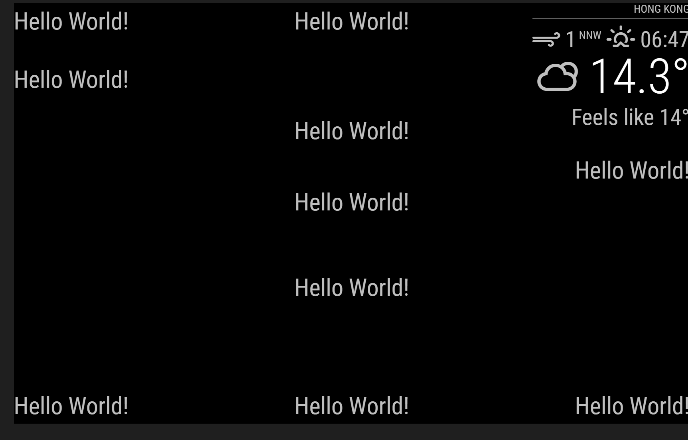

</details>

#### 10/12/2020

---

<details>
  <summary>Build New API with python</summary>
    
  - Getting API key from [News API][3] website
  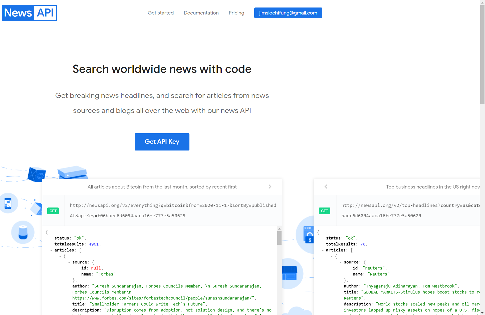

- Request URL and get news_data

  ```python
  def fetch_news(self) -> dict:
      my_params = {"country": "hk", "apiKey": "f06baec6d6094aaca16fe777e5a50629"}
      r = requests.get(self.host + "/" + self.routing, params=my_params)
      request_data = r.json()
      logger.debug(f"Request data: {request_data}")
      return request_data
  ```

- Result:
  ```json
  {
    "status": "ok",
    "totalResults": 30,
    "articles": [
      {
        "source": {
          "id": null,
          "name": "Gq.com.tw"
        },
        "author": "Cynthia Lin",
        "title": "ASUS ROG Zephyrus G14 西風之神 — 擴充頂級效能，也擴充了電競筆電的風尚潛能 - GQ Taiwan",
        "description": "說到頂尖筆電，你認為該有哪些條件呢？若是高效處理器、高解析顯示器或是身歷其境的聲光表現，那你就太小看一台筆電的潛能了！因為這些對殿堂級電競品牌ROG （Republic of Gamers 玩家共和國）來說只是一塊蛋糕般的基本配備。在競爭激烈的產品市場中，ROG以創新的手法不斷探索筆記型電腦的內外極限，進而打造出實現無數想像的Republic of Gamers，在今年推出的ROG Zephyrus G14正是最好的體現，無論是效能或外觀設計都再一次技驚四座。",
        "url": "https://www.gq.com.tw/gadget/article/asusrog-2020",
        "urlToImage": "https://media.gq.com.tw/photos/5fdb193872b6be1221c89316/16:9/w_1920,c_limit/20201202_ASUS(3).jpg",
        "publishedAt": "2020-12-17T10:17:00Z",
        "content": "[SPECIAL] ROG ROGRepublic of GamersROG Zephyrus G14\r\nROGROG Zephyrus G14\r\n ROG Zephyrus G14 AMD Ryzen 4000 CPU  GeForce RTX/GTX GPU8CPU15ROG Zephyrus G14141.6 KG\r\nROG Zephyrus G14Pantone® 100% sRGBDo… [+128 chars]"
      },
      {
        "source": {
          "id": null,
          "name": "Appledaily.com"
        },
        "author": "https://www.facebook.com/hk.nextmedia/",
        "title": "武漢肺炎●全球疫情｜法國總統馬克龍確診出現病徵已接受隔離｜ 蘋果日報 - 香港蘋果日報",
        "description": "根據美國約翰斯霍普金斯大學（JHU）統計，全球感染武漢肺炎的人數已經超過7,408萬，全球死亡人數突破164萬。疫情最嚴重的美國，累計確診突破1,691萬宗，死亡人數突破30.7萬。印度確診人數突破993萬，位居全球第二，死亡人數超過14.4萬，是目前疫情最嚴重的亞洲國家。巴...",
        "url": "https://hk.appledaily.com/international/20201217/L6FUJPJUWVFQJAHS3HWKIBIVXE/",
        "urlToImage": "https://hk.appledaily.com/resizer/svPPOtZN32dpZgnavT7Lx2GJTpE=/720x405/filters:quality(100)/cloudfront-ap-northeast-1.images.arcpublishing.com/appledaily/6ZMS26L5XZHCXJ6DOSCUEMPDTY.jpg",
        "publishedAt": "2020-12-17T09:57:31Z",
        "content": "JHU7,4081641,69130.799314.470418.224010100\r\n7Jean Castex\r\nPedro Sanchez24\r\n27\r\nJens Spahn272727\r\n78\r\nPoliticoFDA40%FDA5\r\n1.1\r\n1.1\r\nPublic Health Wales1.1129151.2\r\nDavid Bernhardt\r\n16\r\n12134.386%11312… [+221 chars]"
      }
    ]
  }
  ```
- Discuss the format of the JSON:

  ```json
  {
    "action": "get_news"
  }
  ```

- Processing the news

  ```python
  def news_process(self, request_data: dict) -> list:
      all_news = []
      articles = request_data["articles"][0:10]
      for article in articles:
          url = article["url"]
          author = article["source"]["name"]
          title = article["title"]
          description = article["description"]
          news = {
              "title": title,
              "author": author,
              "news_content": description,
              "url": url,
          }
          all_news.append(news)
      logger.debug(f"All news: {all_news}")
      return all_news
  ```

- Return all news data

  ```python
  def get_all_news(self):
        try:
            request_data = self.fetch_news()
            all_news = self.news_process(request_data)
            data = {
                "code": 1001,
                "content": all_news
            }
            logger.info("Success to get News API!")
            return data

        except Exception:
            logger.error("Error: get_all_news()")
            logger.error(traceback.print_exc())
            return {"code": -1001, "message": traceback.print_exc()}
  ```

- Return data:

  ```json
  {
    "code": 1001,
    "content": [
      {
        "author": "Mingpao.com",
        "date": "2020-12-17 12:14",
        "news_content": "周梓樂死因研訊今午（17日）續審，庭上讀出法醫郭嘉琪去年11月14日在殮房解剖周梓樂遺體的報告，顯示周梓樂的身高為175厘米，身上有9處治療痕迹，包括左右顱骨都有開腦手術的切口，另有25處近期傷勢，包括盆骨瘀傷、手掌擦傷及腳踝瘀傷等，可能與當日事件有關。",
        "title": "周梓樂死因庭｜法醫：無迹象顯示周梓樂墮地前遇襲手掌有傷不常見(20:00) - 20201217 - 港聞 - 明報新聞網",
        "url": "https://news.mingpao.com/ins/%e6%b8%af%e8%81%9e/article/20201217/s00001/1608204946314/%e5%91%a8%e6%a2%93%e6%a8%82%e6%ad%bb%e5%9b%a0%e5%ba%ad-%e6%b3%95%e9%86%ab-%e7%84%a1%e8%bf%b9%e8%b1%a1%e9%a1%af%e7%a4%ba%e5%91%a8%e6%a2%93%e6%a8%82%e5%a2%ae%e5%9c%b0%e5%89%8d%e9%81%87%e8%a5%b2-%e6%89%8b%e6%8e%8c%e6%9c%89%e5%82%b7%e4%b8%8d%e5%b8%b8%e8%a6%8b"
      },
      {
        "author": "Hk01.com",
        "date": "2020-12-17 11:31",
        "news_content": "【Cyberpunk 2077／電馭叛客2077／PS4／PC】遊戲推出已有一段時間，雖然因為Bug多和在上世代主機運行時表現不佳而受到批評，不過遊戲本身仍然是十",
        "title": "Cyberpunk 2077電馭叛客攻略｜巫師/JoJo/攻殼/銀翼殺手/彩蛋合集｜遊戲動漫 - 香港01",
        "url": "https://www.hk01.com/遊戲動漫/563029/cyberpunk-2077電馭叛客攻略-巫師-jojo-攻殼-銀翼殺手-彩蛋合集"
      }
    ]
  }
  ```

- Build backend server and integrate news API module

  ```python
  from flask import Flask, request
  from flask_cors import CORS
  from news import News_api

  app = Flask(__name__)
  CORS(app)

  @app.route('/')
  def hello():
      return "app is running", 200

  @app.route("/backend", methods=["POST"])
  def backend_services():
      request_data = request.get_json()
      checking_code = request_data["action"]
      if checking_code == "get_news":
          news_api = News_api()
          data = news_api.get_all_news()
          return data

  if __name__ == '__main__':
    app.run(host="0.0.0.0", port=8080)

  ```

</details>

<details>
  <summary>Build js library with news request code</summary>
  
- construct a fetch code use
  ```js
  let requestData = class {
    constructor(direction) {
      let that = this;
      this.url = "https://6029d690dfb1.ngrok.io/backend";
      this.direction = direction;
    }
    /////request to programz
    postData(url, data) {
      // Default options are marked with *

      return new Promise(function (resolve, reject) {
        fetch(url, {
          body: JSON.stringify(data), // must match 'Content-Type' header
          cache: "no-cache", // *default, no-cache, reload, force-cache, only-if-cached
          credentials: "same-origin", // include, same-origin, *omit
          headers: {
            "content-type": "application/json"
          },
          method: "POST", // *GET, POST, PUT, DELETE, etc.
          mode: "cors", // no-cors, cors, *same-origin
          redirect: "follow", // manual, *follow, error
          referrer: "no-referrer" // *client, no-referrer
        }).then((response) => {
          resolve(response.json());
        }); // parses response to JSON
      });
    }

};

````
- link to the mirror by adding the following code to index.html
```html
<script src="js\library.js"></script>
````

- construct a news request code
  ```JS
  newsrequest() {
  let param = {
  	action: "get_news"
  };
  let that = this;
  return new Promise(function (resolve, reject) {
  	let url = that.url;
  	that.postData(url, param).then((res) => {
  		resolve(res);
  	});
  });
  }
  ```
  </details>

<details>

<summary>Construction of hotnews module</summary>

By following the above module build procedure:

```js
Module.register("hotnews", {
  // Default module config.
  defaults: {},

  // Override dom generator.
  getDom: function () {
    var wrapper = document.createElement("div");
    new requestData().newsrequest().then((res) => {
      if (res.code == 1001) {
        res.content.forEach((i) => {
          let news = document.createElement("div");
          let title = document.createElement("div");
          let content = document.createElement("textarea");
          let author = document.createElement("div");
          let url = document.createElement("div");
          let time = document.createElement("div");

          news.setAttribute("class", "hotnews");
          title.setAttribute("class", "newstitle");
          content.setAttribute("class", "content");
          content.setAttribute("disabled", "true");
          time.setAttribute("class", "newstime");
          author.setAttribute("class", "newsauthor");
          // url.setAttribute('class','newsurl');

          title.innerHTML = i.title;
          content.innerHTML = i.news_content;
          time.innerHTML = i.date;
          author.innerHTML = i.author;
          // url.innerHTML = i.url;

          news.appendChild(title);
          news.appendChild(content);
          news.appendChild(author);
          news.appendChild(time);
          // news.appendChild(url);

          wrapper.appendChild(news);
        });
        console.log("wrapper", wrapper);
      } else {
        console.log("unable to recieve news,code", res.code);
      }
    });
    return wrapper;
  },
  requestnews() {},
});
```

- result
  

</details>

<details>
  <summary>Error and solution </summary>
  
##### Error occured

- Cannot request the backend services
  

##### Solution

- Add cross-origin with flask in python
- Step1: `pip install flask_cors` in cmd
- Step2: Import new_module:

```python
from flask import Flask, request
from flask_cors import CORS

app = Flask(__name__)
CORS(app) # add cross-origin
```

</details>

#### 17/12/2020

---

<details>
  <summary> Google assistant custom action</summary>

- Try to add custom action in google assistant
  

- Problem found: Developing Google assistant program from sketch is difficult and time-consuming
  

Solution:

- Connect Google assistant API with IFTTT
  
- IFTTT is a network service platform can connect smart home
  - Connect Google assistant API and integrate it
  - Send message
  - Request URL
- Will consider it in next week

</details>

<details>

<summary> CSS modifly</summary>

- result
  
  

- add extra code to let news renew in every hour

```js
setTimeout(this.getDom(), 3600000);
```

</details>

#### 24/12/2020

---

<details>
  <summary> IFTTT setup</summary>

- Setting up IFTTT account
  

- Launching the TeamViwer application by saying "Open TeamViewer"
  

- TriggerCMD is used, which allows remotely launching command in the Raspberry Pi
  

- The following command is used for launching TeamViewer through TriggerCMD:
  `{"trigger":"teamviewer","command":"xdotool key 1","ground":"foreground","voice":"edit","allowParams": "false"}`

- Connecting Google Assistant to TriggerCMD through Webhook
  

- Launching command in the Raspberry Pi through Google Assistant
  

- More function bases on IFTTT will be developed in the future
  - Read news from News API
  - Control page change
  - Send email

</details>

<details>
  <summary> Switch page </summary>

- separate the default style and our new style


- add script below in order to shift page by key stroke

  ```js
  document.addEventListener("keydown", (e) => {
    console.log(e);
  });
  ```

- Add new function to show/hide eatch page in order to present a shift page action

  ```js
  function showhideframe(number) {
    let store = document.querySelectorAll(".pageframe");
    for (i = 0; i < store.length; i++) {
      if (i == number) {
        store[i].style.display = "none";
      } else {
        store[i].style.display = "block";
      }
    }
  }
  ```

- Will implement the google assistant and switch page later

</details>

#### Semester 1 break

---

<details>
  <summary> Google assistant trigger events</summary>

##### Write auto-boot script for google assisatant

Script for initialization

```bash
#!bin/bash
sudo apt-get update -y &&
sudo apt-get install python3-dev python3-venv -y &&
python3 -m venv env &&
env/bin/python -m pip install --upgrade pip setuptools wheel &&
source env/bin/activate &&
python -m pip install -r requirements.txt &&
python -m pip install --upgrade google-assistant-library==1.0.0 &&
python -m pip install --upgrade google-assistant-sdk[samples]==0.5.1 &&
google-assistant-demo --project-id hip-well-297514 --device-model-id hip-well-297514-raspberrypi-qr7cgk &&
googlesamples-assistant-hotword --project-id hip-well-297514 --device-model-id hip-well-297514-raspberrypi-qr7cgk
```

Script for auto start the google assistant without install dependencies

```
#!bin/bash
python3 -m venv env &&
source env/bin/activate &&
python hotword.py --device-model-id hip-well-297514-raspberrypi-qr7cgk
```


---

##### Setup custom action for google assistant

Download gaction CLI for build Actions SDK


Modify the action.json

```json
{
  "manifest": {
    "displayName": "Get the page",
    "invocationName": "Get the page",
    "category": "PRODUCTIVITY"
  },
  "actions": [
    {
      "name": "com.example.actions.GetPage",
      "availability": {
        "deviceClasses": [
          {
            "assistantSdkDevice": {}
          }
        ]
      },
      "intent": {
        "name": "com.example.intents.GetPage",
        "parameters": [
          {
            "name": "get",
            "type": "Get"
          }
        ],
        "trigger": {
          "queryPatterns": [
            "go to $Get:get",
            "going to $Get:get",
            "move to $Get:get",
            "$Get:get",
            "swap to $Get:get"
          ]
        }
      },
      "fulfillment": {
        "staticFulfillment": {
          "templatedResponse": {
            "items": [
              {
                "simpleResponse": {
                  "textToSpeech": "Going to $get page."
                }
              },
              {
                "deviceExecution": {
                  "command": "com.example.commands.GetPage",
                  "params": {
                    "get": "$get"
                  }
                }
              }
            ]
          }
        }
      }
    }
  ],
  "types": [
    {
      "name": "$Get",
      "entities": [
        {
          "key": "EMAIL",
          "synonyms": ["email page"]
        },
        {
          "key": "CALENDAR",
          "synonyms": ["calendar page"]
        },
        {
          "key": "HOME",
          "synonyms": [
            "homepage",
            "main page",
            "default page",
            "original page",
            "home page"
          ]
        }
      ]
    }
  ]
}
```

Using the following gaction command to update and depoly the custom action

```cmd
gactions update --action_package actions.json --project hip-well-297514
gactions test --action_package actions.json --project hip-well-297514
```


##### Setup event for our project

Success trigger the events from Google Assistant SDK


Modify `hotword.py` for custom actions

```python
def process_event(event):
  """Pretty prints events.

  Prints all events that occur with two spaces between each new
  conversation and a single space between turns of a conversation.

  Args:
      event(event.Event): The current event to process.
  """
  if event.type == EventType.ON_CONVERSATION_TURN_STARTED:
      print()

  print(event)

  if (event.type == EventType.ON_CONVERSATION_TURN_FINISHED and
          event.args and not event.args['with_follow_on_turn']):
      print()
  if event.type == EventType.ON_DEVICE_ACTION:
      for command, params in event.actions:
          print('Do command', command, 'with params', str(params)) # Add the following:
          if command == "com.example.commands.GetPage":
              action = params['get']
              if action == 'HOME':
                  print("Going to home page")
                  pyautogui.press("0")

              if action == 'CALENDAR':
                  print("Going to calendar page")
                  pyautogui.press("1")

              if action == 'EMAIL':
                  print("Going to email page")
                  pyautogui.press("2")

```

Trigger javascript events from google assistant

- Using keypress to send events
- Javascript recieved keyboard signal
- Will build after all module complete

| Keypress | Trigger events |
| -------- | -------------- |
| 0        | homepage       |
| 1        | calendar       |
| 2        | Email          |
| 6        | Play song      |
| 7        | Pause song     |
| 8        | Previous song  |
| 9        | Next song      |

</details>

<details>
  <summary> Music player module (outdated)</summary>

##### Spotify was chosen to be the music player

Used pre-built module from [Github](https://github.com/skuethe/MMM-Spotify)  
 

install modeule

```
cd Project/MagicMirror/modules
git clone https://github.com/raywo/MMM-NowPlayingOnSpotify.git
cd MMM-NowPlayingOnSpotify
npm install
```

Register and setup the Spotify API  
 

Get authorization for Spotify

```
cd MMM-NowPlayingOnSpotify/authorization
node app
```


Embed the module in config.js

```js
{
	module: "MMM-NowPlayingOnSpotify",
	position: "top_right",
	header: "Music Player",
	config: {
		clientID: "e2a5d8afc57345ca989cc8a7427e929d",
		clientSecret: "a13c6f1d0de7419d9a564d82acb8d98a",
		accessToken: "BQD--yTv1ZajR7drgmZ9RicZmG7-Ogw9xu_U8l9hRI0KBQwyHoPm_0TBs6ymR78uyLc5F4N1bU2C8KsQnTyipSTcfuu0buiyZPWeHAEK0-FxJ-RjHv2jZhqiGNS2f0zyQUIROesj66iiybvF4y3Xu9259ITl1L4ZgiGFPyovYg",
		refreshToken: "AQDFXCf9ZaES_2hqJEVipEHELCbToVzCAon_YpnpWfELRXlUeK1U85cb6HOsk1JXIjD13n44eDXLcfJay-s9_-6d4fgrrbi24DUvmNVcC2B2k5Lk7C5ewofPoj3j9iv332s"
	}
  }
```

##### Issues encountered:

1. Don't know how to trigger the spotify module  
   

| Solution                    | Problem                                                         |
| --------------------------- | --------------------------------------------------------------- |
| Use Google assisant trigger | Google Assistant replied "Sorry I cant do this on this device." |
| Play music on device        | Success to trigger but no sound on Raspberry Pi                 |


2. Cannot play music on Raspberry Pi using Spotify

| Solution                                                                                                 | Problem                                                 |
| -------------------------------------------------------------------------------------------------------- | ------------------------------------------------------- |
| Using **Chromium** to play Spotify                                                                       | This browser doesn't support Spotify web player         |
| Use **Raspotify** from [Github](https://github.com/dtcooper/raspotify)                                   | Required Premium and need to use phone to project sound |
| Use **Mopidy** which is a music server extension                                                         | Required Premium                                        |
| Try to search python library to play Spotify                                                             | Don't have music player soption and Required Premium    |
| Use **Spotify API** to build web player sdk                                                              | Required Premium and browser doesn't support            |
| Use **Spotify-Playlist-Player** from [Github](https://github.com/shivasiddharth/Spotify-Playlist-Player) | Success to play song but cannot trigger Spotify API     |


**Due to several unsuccessful tries, we decided to rebuild the music player module**

</details>

<details>
  <summary> New music player module</summary>

##### Study music player build from website


##### Try to build a music player module layout

1. Set All attribute for the audio player

```js
var audio_player = document.createElement("div");
var audio_details = document.createElement("div");
var audio_button_container = document.createElement("div");
var audio_duration = document.createElement("div");

audio_player.setAttribute("class", "player");
audio_details.setAttribute("class", "details");
audio_button_container.setAttribute("class", "buttons-container");
audio_duration.setAttribute("class", "slider_container");
```

2. Audio_details

```js
// audio_details elements
var track_name = document.createElement("div");
var track_artist = document.createElement("div");
var full_name = document.createElement("span");

// audio_details attribute
track_name.setAttribute("class", "track-name");
track_name.innerHTML = "Track Name";
full_name.innerHTML = "-";
full_name.style.paddingLeft = "10px";
full_name.style.paddingRight = "10px";

track_artist.setAttribute("class", "track-artist");
track_artist.innerHTML = "Track Artist";
```

3. Audio button and container

```js
// audio_button elements
var prev_track = document.createElement("div");
var play_pause = document.createElement("div");
var next_track = document.createElement("div");
var prev_logo = document.createElement("i");
var play_logo = document.createElement("i");
var next_logo = document.createElement("i");

// audio_button attribute
prev_track.setAttribute("class", "prev-track");
play_pause.setAttribute("class", "playpause-track");
next_track.setAttribute("class", "next-track");
prev_logo.setAttribute("class", "fa fa-step-backward");
play_logo.setAttribute("class", "fa fa-play");
next_logo.setAttribute("class", "fa fa-step-forward");

// audio_button events
prev_track.addEventListener("click", prevTrack);
play_pause.addEventListener("click", playpauseTrack);
next_track.addEventListener("click", nextTrack);
```

4. Seek slider and audio duration

```js
// audio_duration elements
var current_time = document.createElement("div");
var seek_slider = document.createElement("input");
var total_duration = document.createElement("div");

// audio_duration attribute
current_time.setAttribute("class", "current-time");
current_time.innerHTML = "00:00";

seek_slider.setAttribute("class", "seek_slider");
seek_slider.setAttribute("type", "range");
seek_slider.setAttribute("min", "1");
seek_slider.setAttribute("max", "100");
seek_slider.setAttribute("value", "0");
seek_slider.addEventListener("change", this.seekTo);

total_duration.setAttribute("class", "total-duration");
total_duration.innerHTML = "00:00";
```

5. Marquee for audio details

```js
var marquee = document.createElement("marquee");
marquee.setAttribute("scrollamount", "3");
marquee.setAttribute("width", "80%");
```

6. Append all elements to complete a music player

```js
audio_details.appendChild(track_name);
audio_details.appendChild(full_name);
audio_details.appendChild(track_artist);

marquee.appendChild(audio_details);

prev_track.appendChild(prev_logo);
play_pause.appendChild(play_logo);
next_track.appendChild(next_logo);

audio_button_container.appendChild(prev_track);
audio_button_container.appendChild(play_pause);
audio_button_container.appendChild(next_track);

audio_player.appendChild(marquee);
audio_player.appendChild(audio_button_container);
```

##### Build Javascript to trigger audio file

```js
let next_btn = document.querySelector(".next-track");
let prev_btn = document.querySelector(".prev-track");

// Specify globally used values
let track_index = 0;
let isPlaying = false;
let updateTimer;

// Create the audio element for the player
let curr_track = document.createElement("audio");

// Define the list of tracks that have to be played
let track_list = [
  {
    name: "Night Owl",
    artist: "Broke For Free",
    path:
      "https://files.freemusicarchive.org/storage-freemusicarchive-org/music/WFMU/Broke_For_Free/Directionless_EP/Broke_For_Free_-_01_-_Night_Owl.mp3",
  },
  {
    name: "Enthusiast",
    artist: "Tours",
    path:
      "https://files.freemusicarchive.org/storage-freemusicarchive-org/music/no_curator/Tours/Enthusiast/Tours_-_01_-_Enthusiast.mp3",
  },
  {
    name: "Shipping Lanes",
    artist: "Chad Crouch",
    path:
      "https://files.freemusicarchive.org/storage-freemusicarchive-org/music/ccCommunity/Chad_Crouch/Arps/Chad_Crouch_-_Shipping_Lanes.mp3",
  },
];

function loadTrack(track_index) {
  // Clear the previous seek timer
  clearInterval(updateTimer);
  resetValues();

  // Load a new track
  curr_track.src = track_list[track_index].path;
  curr_track.load();

  // Update details of the track
  let track_name = document.querySelector(".track-name");
  let track_artist = document.querySelector(".track-artist");
  track_name.textContent = track_list[track_index].name;
  track_artist.textContent = track_list[track_index].artist;
  // Set an interval of 1000 milliseconds
  // for updating the seek slider
  updateTimer = setInterval(seekUpdate, 1000);

  // Move to the next track if the current finishes playing
  // using the 'ended' event
  curr_track.addEventListener("ended", nextTrack);

  // Apply a random background color
}

// Functiom to reset all values to their default
function resetValues() {
  let curr_time = document.querySelector(".current-time");
  curr_time.textContent = "00:00";
  let total_duration = document.querySelector(".total-duration");
  total_duration.textContent = "00:00";
  let seek_slider = document.querySelector(".seek_slider");
  seek_slider.value = 0;
}

function playpauseTrack() {
  // Switch between playing and pausing
  // depending on the current state
  if (!isPlaying) playTrack();
  else pauseTrack();
}

function playTrack() {
  // Play the loaded track
  curr_track.play();
  isPlaying = true;

  // Replace icon with the pause icon
  let playpause_btn = document.querySelector(".playpause-track");
  playpause_btn.innerHTML = '<i class="fa fa-pause"></i>';
}

function pauseTrack() {
  // Pause the loaded track
  curr_track.pause();
  isPlaying = false;

  // Replace icon with the play icon
  let playpause_btn = document.querySelector(".playpause-track");
  playpause_btn.innerHTML = '<i class="fa fa-play"></i>';
}

function nextTrack() {
  // Go back to the first track if the
  // current one is the last in the track list
  if (track_index < track_list.length - 1) {
    track_index += 1;
  } else {
    track_index = 0;
  }

  // Load and play the new track
  loadTrack(track_index);
  playTrack();
}

function prevTrack() {
  // Go back to the last track if the
  // current one is the first in the track list
  if (track_index > 0) {
    track_index -= 1;
  } else {
    track_index = track_list.length;
  }
  // Load and play the new track
  loadTrack(track_index);
  playTrack();
}

function seekTo() {
  // Calculate the seek position by the
  // percentage of the seek slider
  // and get the relative duration to the track
  let seek_slider = document.querySelector(".seek_slider");
  seekto = curr_track.duration * (seek_slider.value / 100);

  // Set the current track position to the calculated seek position
  curr_track.currentTime = seekto;
}

function setVolume() {
  // Set the volume according to the
  // percentage of the volume slider set
  curr_track.volume = volume_slider.value / 100;
}

function seekUpdate() {
  let seekPosition = 0;

  // Check if the current track duration is a legible number
  if (!isNaN(curr_track.duration)) {
    seekPosition = curr_track.currentTime * (100 / curr_track.duration);
    let seek_slider = document.querySelector(".seek_slider");
    var color =
      "linear-gradient(90deg, rgb(255,255,255) " +
      seek_slider.value +
      "%, rgb(0,0,0) " +
      seek_slider.value +
      "%)";
    seek_slider.style.background = color;
    seek_slider.value = seekPosition;

    // Calculate the time left and the total duration
    let currentMinutes = Math.floor(curr_track.currentTime / 60);
    let currentSeconds = Math.floor(
      curr_track.currentTime - currentMinutes * 60
    );
    let durationMinutes = Math.floor(curr_track.duration / 60);
    let durationSeconds = Math.floor(
      curr_track.duration - durationMinutes * 60
    );

    // Add a zero to the single digit time values
    if (currentSeconds < 10) {
      currentSeconds = "0" + currentSeconds;
    }
    if (durationSeconds < 10) {
      durationSeconds = "0" + durationSeconds;
    }
    if (currentMinutes < 10) {
      currentMinutes = "0" + currentMinutes;
    }
    if (durationMinutes < 10) {
      durationMinutes = "0" + durationMinutes;
    }

    // Display the updated duration
    let curr_time = document.querySelector(".current-time");
    curr_time.textContent = currentMinutes + ":" + currentSeconds;
    let total_duration = document.querySelector(".total-duration");
    total_duration.textContent = durationMinutes + ":" + durationSeconds;
  }
}
```

##### Build CSS to style the music player

```js
/* Using flex with the column direction to
   align items in a vertical direction */
.player {
  height: 100%;
  display: flex;
  align-items: flex-end;
  flex-direction: column;
  justify-content: center;
  color: #aaa;
}

.details {
  display: flex;
  align-items: center;
  justify-content: center;
  margin-top: 5px;
}

/* Changing the font sizes to suitable ones */

.track-name {
  font-size: 75%;
}

.track-artist {
  font-size: 75%;
}

/* Using flex with the row direction to
    align items in a horizontal direction */

.playpause-track,
.prev-track,
.next-track {
  padding: 10px;
  opacity: 0.8;
  font-size: 100%;

  /* Smoothly transition the opacity */
  transition: opacity 0.2s;
}

/* Change the opacity when mouse is hovered */
.playpause-track:hover,
.prev-track:hover,
.next-track:hover {
  opacity: 1;
}

/* Define the slider width so that it scales properly */
.buttons-container {
  flex-direction: row;
  width: 100%;
  max-width: 400px;
  display: flex;
  justify-content: flex-end;
  align-items: center;
  font-size: 40%;
}

/* Modify the appearance of the slider */
.seek_slider {
  -webkit-appearance: none;
  -moz-appearance: none;
  height: 5px;
  background: linear-gradient(90deg, black 60%, black 60%);
  opacity: 0.7;
  -webkit-transition: 0.2s;
  transition: opacity 0.2s;
}

/* Modify the appearance of the slider thumb */
.seek_slider::-webkit-slider-thumb,
.volume_slider::-webkit-slider-thumb {
  -webkit-appearance: none;
  -moz-appearance: none;
  appearance: none;
  width: 15px;
  height: 15px;
  border-radius: 50%;
  background: transparent;
  cursor: pointer;
}

/* Change the opacity when mouse is hovered */
.seek_slider:hover,
.volume_slider:hover {
  opacity: 1;
}

.seek_slider {
  width: 25%;
}

.volume_slider {
  width: 30%;
}

.current-time,
.total-duration {
  padding: 10px;
}

i.fa-volume-down,
i.fa-volume-up {
  padding: 10px;
}

/* Change the mouse cursor to a pointer
    when hovered over */
i.fa-play-circle,
i.fa-pause-circle,
i.fa-step-forward,
i.fa-step-backward {
  cursor: pointer;
}
```

##### Intital product and Final Product


##### Improvement

- Use python to fetch new song
- Use google assistant trigger
- Use gesture detection trigger
- CSS style improve (add virtualizer or reposition)

</details>

<details>

  <summary> Google calendar and activity</summary>

- study the api from google

  - 
  - try to get the user(our group's) calendar information from google provided function

    - 

  - success linking to account
    - 
    - get infomation success
      - 
  - testing in our platform

    - start

      - 

    - getting authorize
      - 
      - 
      - 
      - 
      - success getting all information in colsole !!!
        - 

</details>

<details>

<summary> Calendar's JavaScript Part</summary>

###### idea from window's default calendar:


#### Our Construction Steps:

1. Init a js new Date() methods

   ```JS
   var date = new Date();
   ```

2. get the year, month, day of today

   ```JS
   var thismonth = date.getMonth();
   var thisyear = date.getFullYear();
   var today = date.getDate();
   ```

3. counting how many days does previous month and this month have

   ```js
   var countday = new Date(thisyear, thismonth, 0).getDate();
   var countpreday = new Date(thisyear, thismonth - 1, 0).getDate();
   ```

   Since getMonth() will only return 0-11

4. get the date of week of the 1st day of this month

   ```js
   var firstday = new Date(thisyear, thismonth, 1).getDay();
   ```

##### After getting all the element we need, start to construct a html base calendar:

1. Adding days in previous month which would display in our calendar

   ```js
   for (i = firstday; i > 0; i--) {
     let day = document.createElement("div");
     let date = document.createElement("div");
     date.innerText = countpreday - i + 2;
     day.setAttribute("class", "day");
     date.setAttribute("class", "predate");
     day.appendChild(date);
     mainbody.appendChild(day);
   }
   ```

   since 'firstday' will only return 0-6, it need +2 duration calculation

2. Adding days in this month

   ```js
   for (i = 1; i < countday + 1; i++) {
     let day = document.createElement("div");
     let date = document.createElement("div");
     date.innerText = i;
     day.setAttribute("class", "day");
     if (i == today) {
       day.setAttribute("id", "today");
     }
     date.setAttribute("class", "date");
     day.appendChild(date);
     mainbody.appendChild(day);
   }
   ```

3. Filling the remaining spaces of calendar

   ```js
   temp = 43 - firstday - countday;
   for (i = temp; i > 1; i--) {
     let day = document.createElement("div");
     let date = document.createElement("div");
     date.innerText = temp - i + 1;
     day.setAttribute("class", "day");
     date.setAttribute("class", "postdate");
     day.appendChild(date);
     mainbody.appendChild(day);
   }
   ```

4. The result:

   

</details>

<details>

<summary> Calendar's CSS Part</summary>

#### Lastly, finish the css part :

###### By using the grid css:

- The code:

```css
#calendar {
  display: grid;
  border: 1px solid white;
  grid-template-columns: repeat(7, 1fr);
  height: 80%;
  width: 100%;
  position: absolute;
}
```

- The results:


##### After Adding and Modify


#### In Progress:

Synchronize with Google Calendar API
Synchronize with reminder Module

</details>

#### 27/01/2021

---

<details>

<summary> Rebuild server structure with Flask and SocketIO</summary>
<br>

Advantage:

- Two way communication
- No need to use keyboard signal to send event
- Can build more event

##### SocketIO installation

Read documentation from [socket.io](https://socket.io/) and [flask-socketio](https://flask-socketio.readthedocs.io/en/latest/)

In python: `pip install flask_socketio`

In Js:
`<script src="https://cdn.socket.io/socket.io-3.0.1.min.js"></script>`

##### Setup new event in python

```python
@socketio.on('connect', namespace='/google-assistant')
def connect():
    join_room("google-assistant")


@app.route("/action", methods=["GET"])
def action():
    emit('google-assistant-action', 'your actual message',
         room="google-assistant", namespace='/google-assistant')
    return "OK", 200
```

##### Setup new event listener in JS

```js
const socket = io("http://localhost:8080/google-assistant");
socket.on("connect", function (msg) {
  console.log("Server connected!");
});
socket.on("google-assistant-action", function (msg) {
  console.log("Success: ", msg);
});
```


</details>

<details>

<summary> Changing the trigger event with SocketIO</summary>
<br>

##### Google assistant events

Modify the google assistant trigger in `hotword.py`

```python
if event.type == EventType.ON_DEVICE_ACTION:
        for command, params in event.actions:
            # Add the following:
            print('Do command', command, 'with params', str(params))
            if command == "com.example.commands.GetPage":
                action = params['get']
                url = "http://localhost:8080/action"
                if action == 'HOME':
                    print("Going to home page")
                    my_params = {"event": "HOME"}
                    r = requests.get(url, params=my_params)

                if action == 'CALENDAR':
                    print("Going to calendar page")
                    my_params = {"event": "CALENDAR"}
                    r = requests.get(url, params=my_params)

                if action == 'EMAIL':
                    print("Going to email page")
                    my_params = {"event": "EMAIL"}
                    r = requests.get(url, params=my_params)
```

Recieve argument from http request and pass to server

```python
@app.route("/action", methods=["GET"])
def action():
    args = request.args.get("event")
    if args == "HOMEPAGE":
        emit('google-assistant-action', 'HOMEPAGE',
             room="google-assistant", namespace='/google-assistant')
    if args == "CALENDAR":
        emit('google-assistant-action', 'CALENDAR',
             room="google-assistant", namespace='/google-assistant')
    if args == "EMAIL":
        emit('google-assistant-action', 'EMAIL',
             room="google-assistant", namespace='/google-assistant')
    if args == "PLAY_SONG":
        emit('google-assistant-action', 'PLAY_SONG',
             room="google-assistant", namespace='/google-assistant')
    if args == "PAUSE_SONG":
        emit('google-assistant-action', 'PAUSE_SONG',
             room="google-assistant", namespace='/google-assistant')
    if args == "NEXT_SONG":
        emit('google-assistant-action', 'NEXT_SONG',
            room="google-assistant", namespace='/google-assistant')
    if args == "PREVIOUS_SONG":
        emit('google-assistant-action', 'PREVIOUS_SONG',
             room="google-assistant", namespace='/google-assistant')

    return "OK", 200
```


Modify event listen with Javascript

```js
const socket = io("http://127.0.0.1:8080/google-assistant");
socket.on("connect", function (msg) {
  console.log("Server connected!");
});

socket.on("google-assistant-action", function (msg) {
  switch (msg) {
    case "EMAIL":
      //showhideframe('0');
      break;

    case "HOMEPAGE":
      showhideframe("0");
      break;

    case "CALENDAR":
      showhideframe("1");
      break;

    case "PLAY_SONG":
      //showhidefrsame('0');
      break;

    case "PAUSE_SONG":
      //showhideframe('0');
      break;

    case "PREVIOUS_SONG":
      //showhideframe('0');
      break;

    case "NEXT_SONG":
      //showhideframe('0');
      break;

    default:
      console.log("couldn't find message/action");
  }
});
```

##### Error encounted


Next week work:

- Fix cross-origin bug
- Add music player event in google assistant
- Add auto fetch song
- Start gesture detection
- Modify CSS

</details>

#### 17/02/2021

---

<details>

<summary> Google calendar API </summary>

##### Review of last progress

- Using JS to build Google calendar API is not working
- It required user login interface
- Decided to find another method

##### Google calendar API registration

Create credentials using service account


###### Reason:

- No need user login interface
- Authorize account in backend service
- Only place the credential file in folder

##### API Work flow


##### Code sample:

```python
class Google_calendar:

    def __init__(self, email="3geniuses2020@gmail.com", cred_file="client_secret.json"):
        self.scopes = ['https://www.googleapis.com/auth/calendar.readonly',
                       "https://www.googleapis.com/auth/calendar"]
        self.email = email
        self.cred_file = cred_file

    def credentials_check(self):
        try:
            creds = service_account.Credentials.from_service_account_file(
                self.cred_file, scopes=self.scopes)
            return creds
        except:
            logger.error("Error: credentails_check()")
            return None

    def get_event(self):
        # Call the Calendar API
        creds = self.credentials_check()
        if not creds:
            return {"success": False, "message": "Fail to get event"}
        service = build('calendar', 'v3', credentials=creds,
                        cache_discovery=False)
        now = datetime.datetime.utcnow().isoformat() + 'Z'  # 'Z' indicates UTC time
        logger.info('Getting the upcoming 10 events')
        events_result = service.events().list(calendarId=self.email, timeMin=now,maxResults=10, singleEvents=True, orderBy='startTime').execute()
        events = events_result.get('items', [])
        return {"success": True, "data": events}
```

##### Server work flow


##### Code sample:

```python
@app.route("/calendar-event", methods=["GET"])
def get_calendar():
    calendar = Google_calendar()
    event = calendar.get_event()
    return json.dumps(event)
```

</details>

<details>

<summary> Fetch Music API </summary>

##### Review of last progress

- Fixed music song
- Decided to fetch popular music every month

##### Code sample for the track list

```js
let track_list = [
  {
    name: "Night Owl",
    artist: "Broke For Free",
    path:
      "https://files.freemusicarchive.org/storage-freemusicarchive-org/music/WFMU/Broke_For_Free/Directionless_EP/Broke_For_Free_-_01_-_Night_Owl.mp3",
  },
  {
    name: "Enthusiast",
    artist: "Tours",
    path:
      "https://files.freemusicarchive.org/storage-freemusicarchive-org/music/no_curator/Tours/Enthusiast/Tours_-_01_-_Enthusiast.mp3",
  },
  {
    name: "Shipping Lanes",
    artist: "Chad Crouch",
    path:
      "https://files.freemusicarchive.org/storage-freemusicarchive-org/music/ccCommunity/Chad_Crouch/Arps/Chad_Crouch_-_Shipping_Lanes.mp3",
  },
];
```

##### API work flow


##### Code sample:

```python
class Fetch_music():

    def __init__(self):
        self.rank_url = "https://www.billboard.com"
        self.rank_url_routing = "charts/billboard-global-200?rank=1"

    def get_music_rank(self):
        result = []
        r = requests.get(self.rank_url + "/" + self.rank_url_routing)
        soup = BeautifulSoup(r.content, "html.parser")
        billboard = soup.find("ol", {"class": "chart-list__elements"})
        all_song = billboard.findAll("li")[0:10]
        logger.debug(f"All song: {all_song}")
        return all_song

    def search_youtube(self, keyword=""):
        videosearch = VideosSearch(keyword, limit=1).result()
        youtube_url = videosearch["result"][0]["link"]
        logger.debug(f"Youtube url: {youtube_url}")
        return youtube_url

    def get_stream_url(self, yt_link="https://www.youtube.com/watch?v=ZmDBbnmKpqQ&ab_channel=OliviaRodrigo-Topic"):
        video = pafy.new(yt_link)
        best = video.getbestaudio()
        logger.debug(f"Streaming url: {best.url}")
        return best.url

    def search_get_track(self, keyword=""):
        url = self.search_youtube(keyword)
        stream_url = self.get_stream_url(url)
        track = {
            "name": keyword.split("-")[0],
            "artist": keyword.split("-")[1],
            "path": stream_url
        }
        return track

    def get_track_list(self, all_song):
        all_track_list = []
        search_list = []

        for song in all_song:
            title = song.find(
                "span", {"class": "chart-element__information__song"}).text
            artist = song.find(
                "span", "chart-element__information__artist").text
            search_list.append(f"{title}-{artist}")

        with ThreadPoolExecutor() as e:
            track_list = list(e.map(self.search_get_track, search_list))
        logger.debug(f"Track list: {track_list}")

        return track_list

    def main(self):
        all_music_rank = self.get_music_rank()
        track_list = self.get_track_list(all_music_rank)
        return track_list
```

##### Server work flow


##### Code sample

```python
@app.route("/get-music", methods=["GET"])
def get_music():
    fetch_music = Fetch_music()
    track_list = fetch_music.main()
    return json.dumps(track_list)
```

</details>

<details>

<summary> Development of status bar and CSS modification</summary>

##### Status Bar

- Status bar is developed to always show essential information
- Status bar contains Day, Time and Weather
- Status will stay in its position when user swaps page
- edit index.html, adding new class "status bar"
  
- change Day, Time position to status bar in config.js

```js
{
			module: "clock",
			position: "status_bar"
		},
{
			module: "currentweather",
			position: "status_bar",
			config: {
				location: "Hong Kong",
				locationID: "1819730", //ID from http://bulk.openweathermap.org/sample/city.list.json.gz; unzip the gz file and find your city
				appid: "442d1a52951b5f05ce286dac6386bd55",
				showFeelsLike: false
			}
		}
```

- Edit CSS for class "status bar" to ensure it always on top

```css
.status.bar {
  height: auto;
  width: 100%;
  position: relative;
}
```

- Position indication(the blue line will not be shown):
  
- in user point of view:
  
- after swap page:
  

##### Minor CSS modifications & future plan

- Enlarge the current time font size
- adjustment of the calendar on the calendar page
- adding transition effect when news swap(will be done)

</details>

<details>

<summary> Synchronised calendar with google's icalendar</summary>

#### 1. get the user's icalendar infomation from backend

```js
var requestCal = new requestData("calendar-event");
```

- result: 

- main structure:

  ```json
  data:{
    success:true/false,
    data:[
      activity[i]:{
        start:{
          date:"the start time"
        },
        end:{
          date:"the end time"
        },
        summary:"the display activity"
      }
    ]
  }
  ```

#### 2. using above data to sync with out calendar

1.  modifly previous code

    - expected result :  

    - some more situation needed to concern : 

    - solution :

      ```js
      function dateadd0(date) {
        let backdata;
        date = date.toString();
        if (date.length == 1) {
          backdata = "0" + date;
        } else {
          backdata = date;
        }
        return backdata;
      }
      ```

    - add new id to date :

      ```js
      day.setAttribute("id", "calendar" + thisyear + parsedate + dateadd0(i));
      ```

    - full code to add google's icalendar activity into our calendar

      ```js
      var requestCal = new requestData("calendar-event");
      requestCal.getData().then((res) => {
        if (res.success == true) {
          /// run when success status == true
          console.log("Get Icalendar success", res);

          let data = res.data;

          data.forEach((e) => {
            let activity = document.createElement("div");
            let summary = document.createElement("div");

            activity.setAttribute("class", "calendar_activity");
            summary.setAttribute("class", "activity_name");

            summary.innerText = e.summary;

            activity.appendChild(summary);
            var date = e.start.date.split("-").join(""); // original: 2021-01-02
            document.querySelector("#calendar" + date).appendChild(activity); /// result: calendar20210211
          });
        } else {
          console.log("Get Icalendar error");
        }
      });
      ```

    - our result : 

    - google's product : 

    - things needed to be modify:
      - color
      - continuous activiy display
      - holiday

</details>

<details>

<summary> Modification of hotnews module</summary>

### main goal: make it only display 3, and loop in every 2 mins

##### concept:

- ask server side only send the multiple of 3's news
- using for loop , when each 3 was generate, it will delay 2 minutes
- add a counter, when already generated all the news, it would loop back to the first news
- finial result code: 
  

- things needed to be modify:
  - css
  - auto scroll to let user view whole news content

</details>

<details>

<summary> Modification of music module</summary>

### goal:

- make it auto request when started
- let google assistant could play song smoothly

#### steps:

- modify code (music module) :

  ```js
  let track_list = []; //init the music list to plays
  new requestData("get-music").getData().then((res) => {
    console.log(res, "get result music");
    track_list = res; // move the result music list from server side to us
  });
  setInterval((f) => {
    new requestData("get-music").getData().then((res) => {
      console.log(res, "get result music");
      track_list = res;
    });
  }, 3600000); //refresh music list every hour
  ```

- modify code (google assistant action):
  ```js
  case "PLAY_SONG": // first time play have to play next song first
    let check = document.querySelector("#breakbetween");
    if (check.innerHTML == "") {
      check.innerHTML = "-";
      nextTrack();
    } else {
      playpauseTrack();
    }
    break;
  ```

</details>

#### 03/03/2021

---

<details>
  <summary> Weather forecast module</summary>

##### Why build this module

- fulfill the space of the smart mirror right side page
- Check 7 days weather

##### Module setup

###### Edit config.js

```js
{
    module: "weatherforecast",
    position: "top_right", // This can be any of the regions.
    // Best results in left or right regions.
    config: {
      // See 'Configuration options' for more information.
      location: "Hong Kong",
      locationID: "1819730", //Location ID from http://bulk.openweathermap.org/sample/city.list.json.gz
      appid: "442d1a52951b5f05ce286dac6386bd55", //openweathermap.org API key.
      units: "metric",
      fade: false
    }
  }
```

###### Result


</details>
<details>

<summary> Email API</summary>

##### API workflow


##### Code sample

```python
class Gmail:

    def __init__(self, email="3geniuses2020@gmail.com", cred_file="client_secret.json"):
        self.scopes = [
            'https://www.googleapis.com/auth/gmail.readonly',
        ]
        self.email = email
        self.cred_file = cred_file

    def credentials_check(self):
        try:
            creds = None

            # The file token.pickle contains the user access token.
            # Check if it exists
            if os.path.exists('token.pickle'):

                # Read the token from the file and store it in the variable creds
                with open('token.pickle', 'rb') as token:
                    creds = pickle.load(token)

            # If credentials are not available or are invalid, ask the user to log in.
            if not creds or not creds.valid:
                if creds and creds.expired and creds.refresh_token:
                    creds.refresh(Request())
                else:
                    flow = InstalledAppFlow.from_client_secrets_file(
                        'credentials.json', self.scopes)
                    creds = flow.run_local_server(port=0)

                # Save the access token in token.pickle file for the next run
                with open('token.pickle', 'wb') as token:
                    pickle.dump(creds, token)
            return creds
        except:
            logger.error(traceback.print_exc())
            logger.error("Error: credentails_check()")
            return None

    def get_email(self):
        creds = self.credentials_check()
        if not creds:
            return {"success": False, "message": "Fail to get email"}
        service = build('gmail', 'v1', credentials=creds,
                        cache_discovery=False)

        # Call the Gmail API
        all_email_data = []
        results = service.users().messages().list(
            userId=self.email, q="category:primary", maxResults=10).execute()
        messages = results.get("messages")
        for msg in messages:
            message = service.users().messages().get(
                userId=self.email, id=msg["id"]).execute()
            try:
                payload = message["payload"]
                headers = payload["headers"]
                for d in headers:
                    if d["name"] == "Subject":
                        subject = d["value"]
                    if d["name"] == "From":
                        sender = d["value"]
                    if d["name"] == "Date":
                        date_time = dateparser.parse(d["value"])
                        date = date_time.strftime("%Y-%m-%d %H:%M")
                if "data" in payload['body']:
                    data = payload['body']['data']
                elif "data" in payload['parts'][1]['body']:
                    data = payload['parts'][1]['body']['data']
                data = data.replace("-", "+").replace("_", "/")
                decoded_data = base64.b64decode(data)
                email_data = {
                    "subject": subject,
                    "from": sender,
                    "body": decoded_data.decode("utf-8"),
                    "date": date
                }
                logger.debug(f"Body: {decoded_data}")
                all_email_data.append(email_data)
            except:
                print(traceback.print_exc())
                pass
        return {"success": True, "data": all_email_data}
```

##### Server workflow


##### Code sample

```python
@app.route("/get-email", methods=["GET"])
def get_email():
    email_api = Gmail()
    email_data = email_api.get_email()
    return json.dumps(email_data)
```

</details>

#### 30/03/2021

---

<details>

<summary> Program testing and bug fixed</summary>


Solution:

```JS
try {
  var date = "#calendar" + e.start.date.split("-").join("");
} catch (err) {
  let tempdate = "";
  for (i = 0; i < 10; i++) {
    tempdate += e.start.dateTime[i];
  }
  var date = "#calendar" + tempdate.split("-").join("");
  console.log("new date", date);
}
try {
  document.querySelector(date).appendChild(activity);
} catch (err) {}
```

</details>

<details>

<summary> finalised google assistant trigger action</summary>


</details>

### Reference

---

- [MagicMirror.builder][1]
- [Google Assistant SDK Docs][2]
- [News API][3]
- [IFTTT][4]
- [SocketIO][5]
- [Google Calendar API][6]

[1]: https://docs.magicmirror.builders/
[2]: https://developers.google.com/assistant/sdk/guides/service/python
[3]: https://newsapi.org/
[4]: https://ifttt.com/home
[5]: https://socket.io/
[6]: https://developers.google.com/calendar/v3/reference
